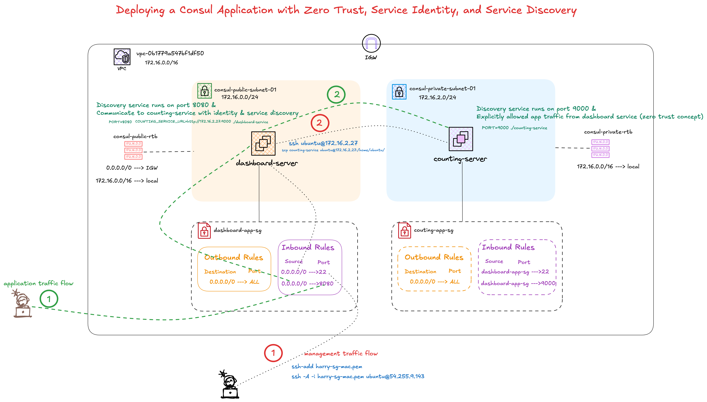

# Consul Demo App on EC2



This deployment uses two EC2 instances:

- **Dashboard service:** runs in a **public subnet** at `54.255.9.143:8080` so users can access the application.
- **Counting service:** runs in a **private subnet** at `172.16.2.27:9000` and is reached only by the dashboard.

The counting service does not need to communicate directly with users, so it should be in the private subnet. Its security group should allow port `9000` only from the dashboard service (or its security group), not from the internet.

Configure the counting service first because the dashboard calls it as a downstream service.

## 1. Download the Linux AMD64 binaries

```bash
curl -fL -O https://github.com/hashicorp/demo-consul-101/releases/download/v0.0.5/counting-service_linux_amd64.zip
curl -fL -O https://github.com/hashicorp/demo-consul-101/releases/download/v0.0.5/dashboard-service_linux_amd64.zip
```

Extract the downloaded ZIP files and make the binaries executable:

```bash
unzip counting-service_linux_amd64.zip
unzip dashboard-service_linux_amd64.zip
chmod +x counting-service dashboard-service
```

## 2. Connect through the public EC2 instance

From the Mac:

```zsh
ssh-add harry-sg-mac.pem
ssh -A -i harry-sg-mac.pem ubuntu@54.255.9.143
```

Copy the counting-service binary to the private instance:

```bash
scp counting-service ubuntu@172.16.2.27:/home/ubuntu/
```

## 3. Configure the counting service first

On the private counting-service instance (`172.16.2.27`), create the unit file:

SSH from dashboard server to consul server
```bash
ssh ubuntu@172.16.2.27
```

```bash
sudo vim /etc/systemd/system/counting-service.service
```

```ini
[Unit]
Description=Consul Demo Counting Service
After=network.target

[Service]
Type=simple
User=ubuntu
Group=ubuntu
WorkingDirectory=/home/ubuntu
Environment="PORT=9000"
ExecStart=/home/ubuntu/counting-service
Restart=always
RestartSec=5

[Install]
WantedBy=multi-user.target
```

Enable and start it:

```bash
sudo systemctl daemon-reload
sudo systemctl enable --now counting-service
sudo systemctl status counting-service
```

Successful result:

```text
● counting-service.service - Consul Demo Counting Service
     Loaded: loaded (/etc/systemd/system/counting-service.service; enabled; preset: enabled)
     Active: active (running)
   Main PID: 3170 (counting-servic)
             └─3170 /home/ubuntu/counting-service

counting-service[3170]: Serving at http://localhost:9000
```

## 4. Configure the dashboard service

On the public dashboard instance, create the unit file:

```bash
sudo vim /etc/systemd/system/dashboard-service.service
```

```ini
[Unit]
Description=Consul Demo Dashboard Service
After=network.target

[Service]
Type=simple
User=ubuntu
Group=ubuntu
WorkingDirectory=/home/ubuntu/pov-consul/demo-consul-101/ubuntu-app-binary
Environment="PORT=8080"
Environment="COUNTING_SERVICE_URL=http://172.16.2.27:9000"
ExecStart=/home/ubuntu/pov-consul/demo-consul-101/ubuntu-app-binary/dashboard-service
Restart=always
RestartSec=5

[Install]
WantedBy=multi-user.target
```

Enable and start it:

```bash
sudo systemctl daemon-reload
sudo systemctl enable --now dashboard-service
sudo systemctl status dashboard-service
```

Successful result:

```text
● dashboard-service.service - Consul Demo Dashboard Service
     Loaded: loaded (/etc/systemd/system/dashboard-service.service; enabled; preset: enabled)
     Active: active (running)
   Main PID: 33462 (dashboard-servi)
             └─33462 /home/ubuntu/pov-consul/demo-consul-101/ubuntu-app-binary/dashboard-service

dashboard-service[33462]: New client connected
dashboard-service[33462]: Fetched count 15
dashboard-service[33462]: Fetched count 16
dashboard-service[33462]: Fetched count 23
```

`Restart=always` restarts a service after it exits. `RestartSec=5` waits five seconds before that restart.

