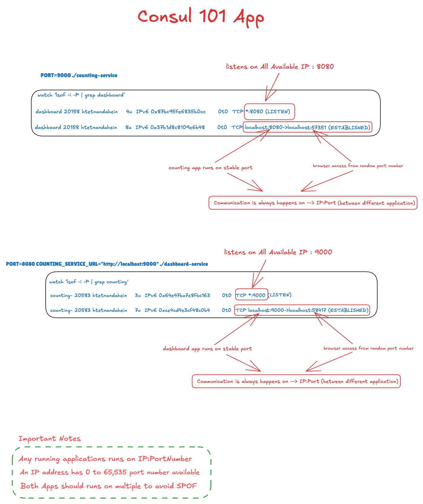
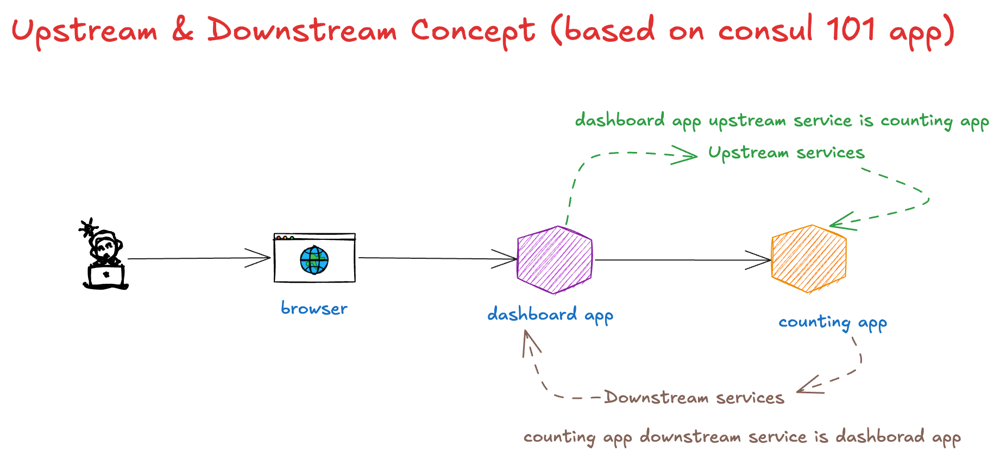

# Consul demo sample app

Consul 101 App(service identity & service discovery)


Upstream & Downstream concept consul app



Run each service in a separate terminal.

## 1. Start the counting service

```zsh
PORT=9000 ./counting-service
```

Verify it is listening on port `9000`:

```zsh
watch 'lsof -i -P | grep counting'
```

Example result:

```text
Every 2.0s: lsof -i -P | grep counting
counting- 20583 htetnandahein  3u  IPv6  ...  TCP *:9000 (LISTEN)
counting- 20583 htetnandahein  7u  IPv6  ...  TCP localhost:9000->localhost:58417 (ESTABLISHED)
```

## 2. Start the dashboard service

```zsh
PORT=8080 COUNTING_SERVICE_URL="http://localhost:9000" ./dashboard-service
```

Verify it is listening on port `8080`:

```zsh
watch 'lsof -i -P | grep dashboard'
```

Example result:

```text
Every 2.0s: lsof -i -P | grep dashboard
dashboard 20158 htetnandahein  4u  IPv6  ...  TCP *:8080 (LISTEN)
dashboard 20158 htetnandahein  8u  IPv6  ...  TCP localhost:8080->localhost:57351 (ESTABLISHED)
```

Open the dashboard at http://localhost:8080.

Press `Ctrl+C` to stop `watch` or either running service.
